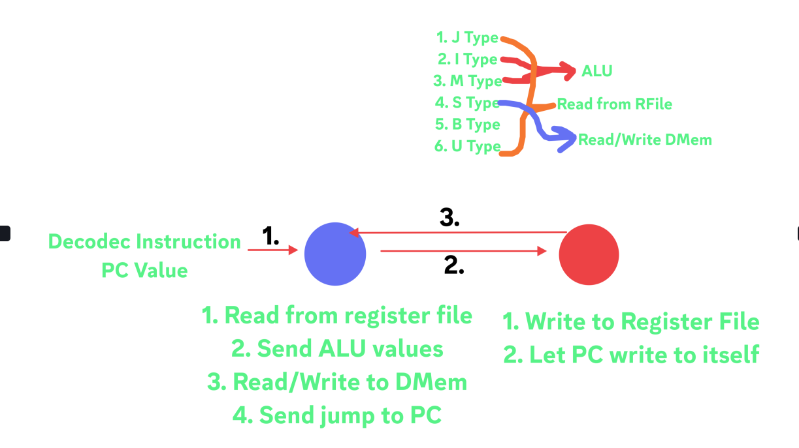

# APEXCORE - A RISC-V BASED CPU CORE : EKLAVYA'24
---

#### The RISC-V CPU will be implemented with Multiplication and Atomic Extension. Implementation of Control and Status Registers along with memory segmentation in Data Memory for Input-Ouput capability.

---
### Introduction

RISC-V  is an instruction set architecture like ARM based on RISC (Reduced Instruction Set Architecture) principles. What sets RISC-V ISA different from others ISAs is its completely open source and free to use.

Due to being open-source in nature, RISC-V provides a vital step in designing, building and testing new hardware without paying any license fees or royalties

---
### How to flash the code on FPGA

To Flash the code in the FPGA, you must have AMD Xilinx Vivado Suite installed. Installations for your working operation systems can be done [here](https://www.amd.com/en/products/software/adaptive-socs-and-fpgas/vivado.html).

After Installation, there are two ways to generate bitstream files.

#### 1. Using GUI
 - Open Vivado.
 - Create a new project, and add all the rtl files as source files.
 - Once the project is opened, go to Generate Bitstream in the left menu and click on it.
#### 2. Using CLI
 - Source necessary files for vivado in terminal, by

```
    source /opt/Xilinx/Vivado/202x.x/settings64.sh
```
 - Now, run the code by 

```
    vivado -mode batch -source ApexCore_RISC-V_CPU/assets/top.tcl
```

This will create binary file for flashing on FPGA, make sure that your FPGA is connected to your device before running above command

---
## Workflow
This a 2-stage processor. In the first stage, 
- The instructions are fetched and decoded.
- Values are read from register file.
- Determination of instruction type. 
- Sending necessary parameters to ALU if needed.
- Writing in DMem and sending read signals. 
- Send jump to PC. 

And in 2nd stage,
- Get ALU output
- Read Data from DMem.
- Control Unit writes to register file 
- PC executes jump instruction 
- Show output on seven segment display.

Following is the block diagram and workflow in simple terms of our CPU:-




---

### Tech Stack

- Verilog
- Xilinx Vivado 
---
### Future Work
- [ ] Interrupt handling.
- [ ] UART implmentation.
- [ ] Implementation of remaining extensions.
---
## Contributors

- [Saish Karole](https://github.com/NachtSpyder04)
- [Atharva Kashalkar](https://github.com/RapidRoger18)
- [Aditya Mahajan](https://github.com/aditya200523)
- [Shri Vishakh Devanand](https://github.com/LOuLOu-THEKing)
  


---
### Acknowledgements and Resources

- [SRA VJTI Eklavya 2024](https://sravjti.in/)
  
  
---